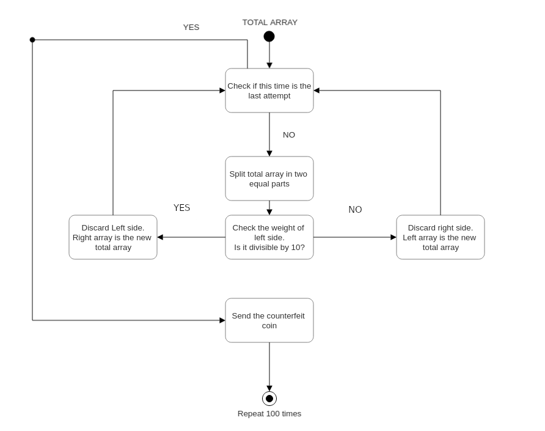

# Coin1
This challenge consists in guessing which is the counterfeit coin, with a number of coins that can go from 1 to 999, with a limited number of attempts available in 60 seconds.
```
[+] Start Pwnable Challenge....

	---------------------------------------------------
	-              Shall we play a game?              -
	---------------------------------------------------
	
	You have given some gold coins in your hand
	however, there is one counterfeit coin among them
	counterfeit coin looks exactly same as real coin
	however, its weight is different from real one
	real coin weighs 10, counterfeit coin weighes 9
	help me to find the counterfeit coin with a scale
	if you find 100 counterfeit coins, you will get reward :)
	FYI, you have 60 seconds.
	
	- How to play - 
	1. you get a number of coins (N) and number of chances (C)
	2. then you specify a set of index numbers of coins to be weighed
	3. you get the weight information
	4. 2~3 repeats C time, then you give the answer
	
	- Example -
	[Server] N=4 C=2 	# find counterfeit among 4 coins with 2 trial
	[Client] 0 1 		# weigh first and second coin
	[Server] 20			# scale result : 20
	[Client] 3			# weigh fourth coin
	[Server] 10			# scale result : 10
	[Client] 2 			# counterfeit coin is third!
	[Server] Correct!

	- Ready? starting in 3 sec... -

```

To win this challenge I decided to use a very simple recursive algorithm. Initially I generate numbers from 1 to N, then I split the array in the middle and through the total weight of those numbers I can figure out which of the two lists contains the counterfeit coin. I do this until I get a list with only one number, which is the counterfeit coin.

<p align="center"></div>

## Solution

First I created this recursive function, which checks the weight of the left side of the array, then calls itself passing the side of the array with the counterfeit coin.

```
def find_counterfeit_coin(coins, attempts):
    number_of_coins = len(coins)

    if attempts > 0:
        left = coins[:int(math.ceil(number_of_coins/2))]
        right = coins[int(math.trunc(number_of_coins/2)):]

        try:
            left_w = get_weight(args=left)
            left_weight = int(left_w)
        except ValueError:
            print("[-] " + str(left_w))
            return
        attempts -= 1
        if left_weight % 10 == 0:
            attempts = find_counterfeit_coin(coins=right, attempts=attempts)
        else:
            attempts = find_counterfeit_coin(coins=left, attempts=attempts)
    else:
        print("[+] " + str(send_coin(coin=coins)))
```

The get_weight() function sends the list of coins and waits for the response from the server, which will be the total weight of those coins.
```
def get_weight(args):
    cmd = ""
    for i in range(0, len(args)):
        cmd += str(args[i]) + " "

    r.sendline(cmd.encode())
    return r.recvline().decode('utf-8')
```
And finally the send_coin() function sends the counterfeit coin.
```
def send_coin(coin):
    r.sendline(str(coin[0]).encode())
    return r.recvline().decode('utf-8')
```

## Connection too slow
After a first try I noticed that the exploit connection is very slow and 60 seconds is not enough to complete the challenge.
```
...

[+] Set parameters ->     N=679 C=10
[+] Correct! (31)

[+] Set parameters ->     N=636 C=10
[+] Correct! (32)

[+] Set parameters ->     N=20 C=5
[+] Correct! (33)

[+] Set parameters ->     N=33 C=6
[+] Correct! (34)

[+] Set parameters ->     N=752 C=10
[+] Correct! (35)

[+] Set parameters ->     N=818 C=10
[+] Correct! (36)

[+] Set parameters ->     N=114 C=7
[+] Correct! (37)

[+] Set parameters ->     N=568 C=10
[+] Correct! (38)

[+] Set parameters ->     N=276 C=9
[+] Correct! (39)

[+] Set parameters ->     N=478 C=9
[+] Correct! (40)

[+] Set parameters ->     N=595 C=10
[-] time expired! bye!

```

To solve this problem, I uploaded the exploit in one of the previous challenges, connecting with ssh, in order to start it inside the pwnable network.

```
...

[+] Set parameters ->     N=37 C=6
[+] Correct! (85)

[+] Set parameters ->     N=755 C=10
[+] Correct! (86)

[+] Set parameters ->     N=819 C=10
[+] Correct! (87)

[+] Set parameters ->     N=634 C=10
[+] Correct! (88)

[+] Set parameters ->     N=50 C=6
[+] Correct! (89)

[+] Set parameters ->     N=665 C=10
[+] Correct! (90)

[+] Set parameters ->     N=21 C=5
[+] Correct! (91)

[+] Set parameters ->     N=956 C=10
[+] Correct! (92)

[+] Set parameters ->     N=332 C=9
[+] Correct! (93)

[+] Set parameters ->     N=610 C=10
[+] Correct! (94)

[+] Set parameters ->     N=469 C=9
[+] Correct! (95)

[+] Set parameters ->     N=337 C=9
[+] Correct! (96)

[+] Set parameters ->     N=22 C=5
[+] Correct! (97)

[+] Set parameters ->     N=845 C=10
[+] Correct! (98)

[+] Set parameters ->     N=653 C=10
[+] Correct! (99)

Congrats! get your flag
***********************		# I will not reveal the flag to you buddy :)

```

The result is markedly different!